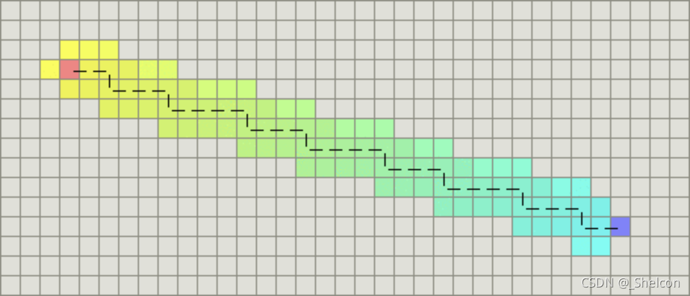
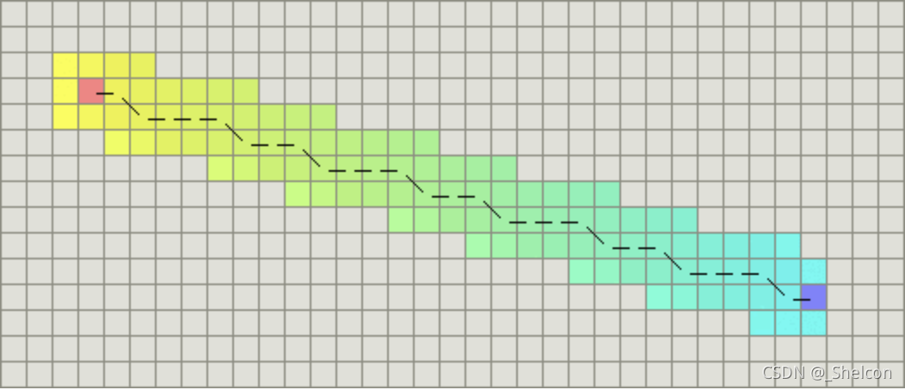

# 1.Astar简介
Astar算法是一种图形搜索算法，常用于寻路。Astar是个以广度优先搜索为基础，集Dijkstra算法与最佳优先(best fit)算法特点于一身的一种算法。

计算每个节点的优先级（代价），选择优先级最高的节点作为下一个待遍历的接节点
优先级函数：

$$f(n) = g(n) + h(n)$$

其中：

1. $g(n)$ 是节点n距离起点的代价。
2. $h(n)$是节点距离终点的预计代价，也就是A*算法的启发函数。

Astar伪代码：

```c++
//使用open_set、close_set来表示待遍历和已遍历的节点集合
 
open_set = PriorityQueue()//使用优先队列，每次选取优先级最高的节点
open_set.put(start,0)//将起点加入open_set
close_set = {} //close_set,顺便记录节点距起点的代价
came_from = {} //记录节点的父节点
came_from[start] = None
 
while(!open_set.empty())//当待遍历节点集合不为空时循环
{
    current = open_set.get()//取出优先级最高的节点
    
    if(current == goal)
    {
        //找到终点后，返回路径（此处省略）
        break
    } 
    
    
    for next in graph.neighbors(current)//遍历当前节点的邻近节点
    {
        new_cost = close_set[current] + graph.cost(current,next)//计算next节点的代价
        if(!close_set.contain(next) or new_cost < close_set[next])//如果next节点不在close_set中（未遍历过）或者有更小的代价
        {
            close_set[next] = new_cost //更新代价
            priority = new_cost + h(n) //使用g(n)和h(n)计算优先级
            open_set.put(next,priority)//将next节点加入open_set中
            came_from[next] = current //设置其父节点
        }
    }
}
```
# 2.启发函数对A*算法的行为的影响:

        1.在极端情况下，当启发函数h(n)始终为0，则由g(n)来决定节点的优先级，此时算法就退化成了Dijkstra算法。

        2.在另一个极端情况下，如果h(n)相较于g(n)大很多，则此时只有h(n)产生效果，这也就变成了最佳优先搜索。

        3.如果h(n)始终小于等于节点n到终点的代价，被称为可接受启发式的A*，则A*算法一定保证能够找到最短路径。但是当h(n)的值越小，算法遍历越多的节点，导致算法越慢。

        4.如果h(n)完全等于节点n到终点的代价，则A*算法将找到最佳路径并且速度很快。但是很难做到这一点，因为很难确切算出距离终点还有多远。

        5.如果h(n)的值比节点n到终点的代价要大，则A*算法不能保证找到最短路径，不过此时会很快。

        通过调节启发函数我们可以控制算法的速度和精确度。因为在一些情况，我们可能未必需要最短路径，而是希望能够尽快找到一个路径即可。这也是A*算法比较灵活的地方。


# 3.对网格形式的图，有以下这些启发函数可以使用：

1.如果图形中只允许朝上下左右四个方向移动，则可以使用曼哈顿距离（Manhattan distance）。

2.如果图形中允许朝八个方向移动，则可以使用对角距离。

3.如果图形中允许朝任意方向移动，则可以使用欧几里得距离。

## 曼哈顿距离


         计算曼哈顿距离的函数如下，这里的D是指两个相邻节点之间的移动代价，通常是一个固定的常数：

```c++
function heuristic(node)
    local dx = abs(node.x-goal.x)
    local dy = abs(node.y-goal.y)
    return D * (dx + dy)
end
```

## 对角距离


计算对角距离的函数如下，这里的D2指的是两个斜着相邻节点之间的移动代价。如果所有节点都正方形，则其值就是：

$$ /sqrt{2}*D$$

```c++
function heuristic(node)
    local dx = abs(node.x-goal.x)
    local dy = abs(node.y-goal.y)
    return D * (dx + dy) + (D2 - 2 * D) * min(dx,dy)
end
```
## 欧几里得距离

如果图形中允许朝任意方向移动，则可以使用欧几里得距离。
欧几里得距离是指两个节点之间的直线距离，因此其计算方法也是我们比较熟悉的：

$$\sqrt{(p2.x-p1.x)^2+(p2.y-p1.y)^2} $$

```c++
function heuristic(node) =
    local dx = abs(node.x-goal.x)
    local dy = abs(node.y-goal.y)
    return D * sqrt(dx * dx + dy * dy)
end
```

 # 4.算法变种

    ARA* ARA*全称是Anytime Repairing A，也称为Anytime A
    D*
    Field D*
    Block A*