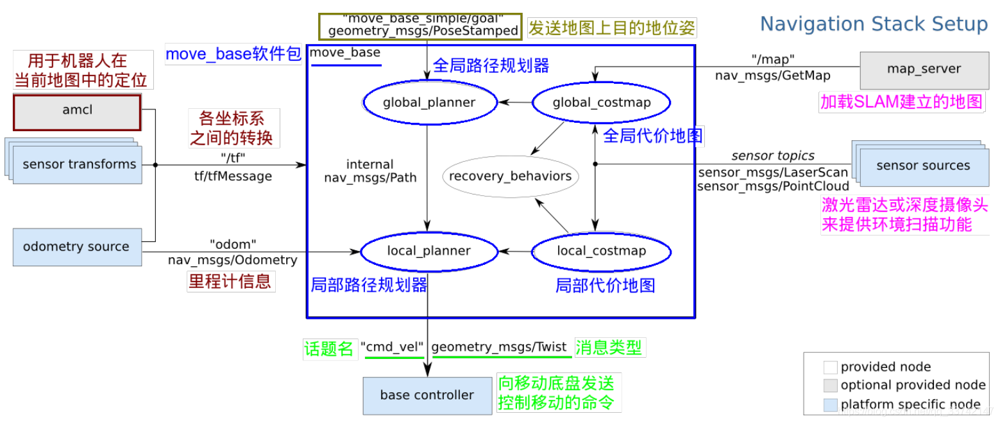
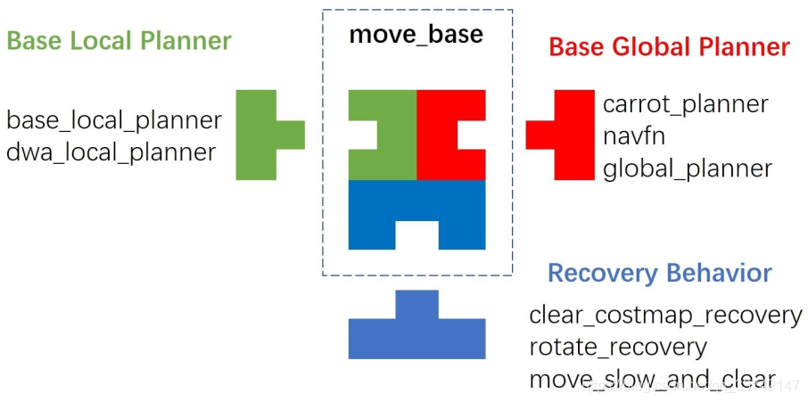

# movebase结构

ROS 提供的 move_base 包在已建立好的地图中指定目标位置和方向后, move_base 根据机器人的传感器信息控制机器人到达目标位置。

它主要功能包括:结合机器人的里程计信息和定位信息,作出路径规划,输出前进速度和转向速度。目前在机器人SLAM及导航的使用中不可避免地需要使用movebase提供的安全可靠的机制。

move_base 是导航包Navigation的核心,它包含了很多的插件, 这些插件用于负责一些更细微的任务:全局规划、局部规划、全局地图、局部地图、恢复行为,他们之间的关系如下图所示

 move_base在运行过程中调用这些插件，从而实现特定的功能。

Move_base主要由两部分组成：

    规划器：全局规划、局部规划与行为恢复
    代价地图：全局代价地图和局部代价地图

下图给出了默认的局部规划器与全局规划器等插件，为了实现更个性化的功能，推荐自己原创的或改进的规划器来替代相应的部分，甚至可以去掉不需要的插件，如代价地图、恢复机制等。

系统默认插件及实现功能如下：

|插件文件|实现功能|
|  :----:  | :----:  |
base_local_planner   |	     实现了 Trajectory Rollout 和 DWA 两- | :-: | :-:
种局部规划算法
dwa_local_planner    |       实现了DWA局部规划算法
global_planner            |       实现局部规划算法，可在参数中进行选择，默认存在parrot_planner, navfn, lobal_planner三种规划算法可以选择
local_costmap             |       局部代价地图，与局部规划器配合使用
global_costmap          |       全局代价地图

注意：插件的参数是在yaml文件中进行配置，yaml文件位于你所运行的驱动文件包中，但插件的调用是在move_base.cpp源码中调用的，意味着yaml文件并不是必需的，你可以自己来编写自己的全局和局部规划算法，在生成节点名字后修改move_base_params.yaml文件的base_local_planner和base_global_planner对应的参数即可生效。关于movebase的其他参数大家需要根据规划器进行修改。
